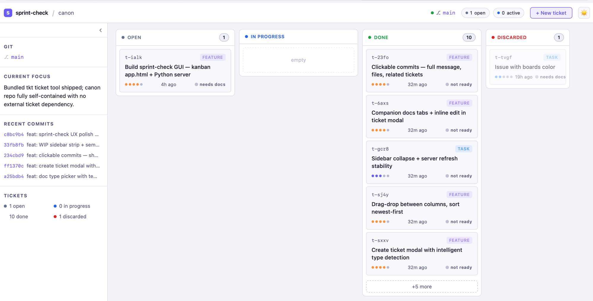

# sprint-check — Local Kanban Dashboard

A browser-based kanban board that reads the current project's tickets, HANDOFF.md, and git history. No cloud, no login, no install beyond canon.



## Getting Started

**Step 1 — Register sprint** (adds `canon/tools` to your PATH if needed):
```bash
skills.sh add sprint /path/to/your/project
```

`sprint-check` is a bundled tool used by the sprint workflow; it does not need separate registration in normal projects.

**Step 2 — Launch from your project:**
```bash
sprint-check
```

The board opens in your default browser at `http://127.0.0.1:<port>`. Press `Ctrl+C` to stop.

## Board

Four columns map directly to `tkt` statuses. New tickets use the canonical
`.tickets/<id>/ticket.md` folder layout; legacy `.tickets/<id>.md` files remain
readable.

| Column | tkt status |
|--------|-----------|
| Open | `open` |
| In Progress | `in_progress` |
| Done | `closed` |
| Discarded | `cancelled` |

**Cards** show ticket ID, type badge, title, priority dots, age, and a readiness indicator:
- `● ready` (green) — Acceptance and Plan both present and complete, with `plan.md ## Sign-off` checked
- `● incomplete` (red) — acceptance.md exists but is missing checklist items under ## Criteria or ## Test Plan; `sprint complete` will block
- `● plan incomplete` (red) — plan.md exists but ## Approach is empty or still placeholder text
- `● needs acc` / `● needs plan` / `● needs signoff` (amber) — the next sprint doc or approval item to add

Click or hover the readiness indicator for a checklist popover. Click anywhere else on the card to open the full ticket.

**Search** above the columns filters tickets by title, id, status, type, priority,
description, sprint doc names, and readiness labels such as `plan incomplete`.
Matches stay in their original columns. Press `Esc` or clear the field to show
the full board again.

Switch the mode from `Search` to `Why` to enter a project-relative file path and
show the tickets and Plan decisions behind that file's git history. The shortcut
syntax `why:path/to/file` switches modes from the keyboard.

**Moving tickets:**
- Drag and drop between columns
- Open ticket modals use `Esc` to close; status changes happen by dragging cards
  between columns.

**Column count badge** is hidden when a column is empty.

## Sidebar

- **Now Working On** — `in_progress` tickets highlighted in accent color; click to open, or hit `copy` to copy the commit prefix (`t-xxxx: `) to clipboard
- **Git** — current branch + modified file count
- **Current Focus** — `## Current Focus` section from HANDOFF.md
- **Recent Commits** — last 5 commits (click any to see full message, changed files, and related tickets)
- **Tickets** — count summary by status

Collapse/expand the sidebar with the `‹` toggle. Width is remembered across sessions.

## Ticket Modal

Click any card to open its detail view:

- **Meta row** — Status, Type, Priority, Age, Ready indicator
- **Tabs** — Description tab appears only when companion docs exist; otherwise body is shown directly
- **Docs** — Acceptance and Plan as tabs; click `+ New doc` only while one of those docs is missing
- **Edit** — inline edit for the ticket body or any doc; Save / Cancel
- **Resize** — drag the bottom-right handle when long Description, Acceptance, or Plan content needs more room
- **Footer** — `Discard ticket ×`; keyboard hint bottom-right shows `Esc`

Closed and discarded tickets are read-only in the modal.

## Sprint Docs

After `sprint start`, the ticket appears In Progress and not ready because only
`ticket.md` exists. Use `+ New doc` to add sprint docs in this order:

| Doc | Use it to |
|-----|-----------|
| Acceptance | Define binary done criteria and the test plan |
| Plan | Capture the approach and decisions before source edits |

Templates include comments for the lines and headings users should keep
unchanged. In edit mode, the toolbar inserts common Markdown at the cursor:
checkboxes, checked items, bullets, numbered items, headings, inline code, and
toggle blocks.

Once both Acceptance and Plan exist, `+ New doc` is hidden. Canon's sprint flow
does not use extra board-created sprint docs.

`orient`, `impact-analysis`, `capture`, and wrapup checks are sub-skills run by
the agent during the sprint lifecycle. They are not `+ New doc` types. When they
produce useful context, the agent records it in the sprint docs, `HANDOFF.md`, or
`DECISIONS.md`.

Use `Discard ticket` only when the work is abandoned or no longer needed. It
moves the ticket to the Discarded column instead of Done and asks for
confirmation first.

## New Ticket

Click `+ New` in the header. As you type the title, the type (Feature / Task / Bug / etc.) is detected automatically. Select type and priority, write a description, and submit — the ticket lands in Open using the canonical folder layout.

## Agent Workflow

- Use sprint-check to get your bearings at session start: "open sprint-check and tell me what's in progress"
- Agents read sprint-check for context; status changes happen via `tkt` commands
- The **Now Working On** strip + `copy` button makes it easy to prefix commits with the active ticket ID
- A green readiness dot signals a ticket has acceptance criteria, a plan, and checked plan sign-off for the agent to act on without asking for clarification

## Notes

- Refreshes automatically every 8 seconds
- Dark/light mode toggle in the header — preference persisted in localStorage
- `sprint-check` runs on macOS, Linux, and WSL with Python 3 stdlib only, no pip required
- `sprint-check-win` runs the Go server for Windows/Git Bash users
- Port defaults to 8423, increments automatically if busy
